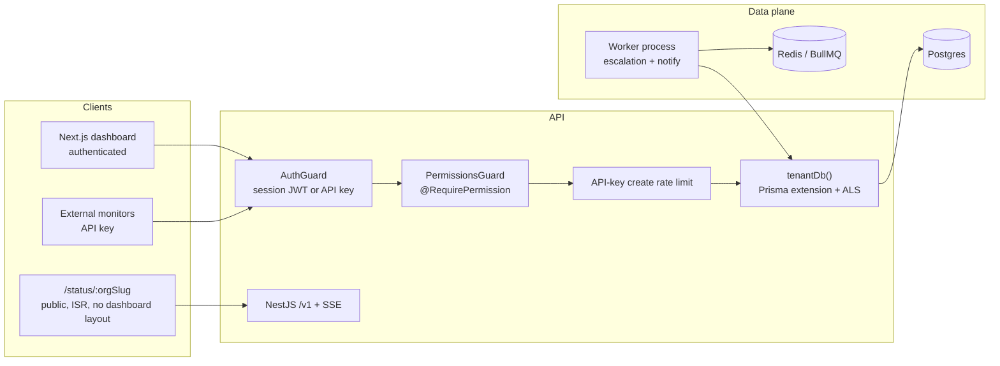
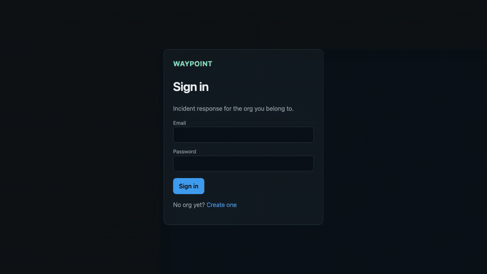

# Waypoint

Multi-tenant incident response and public status pages — a PagerDuty + Statuspage hybrid.

Organizations define services and on-call rotations. When something breaks, an incident is opened, responders act on a real state machine, and an **unauthenticated** status page reflects that org’s current and historical status. Every query is tenant-scoped at the data-access layer. Every mutating endpoint is gated by RBAC on the API, not by frontend route guards.

## Quickstart (local, ~10 minutes)

Requires Docker, Node 22, and pnpm 9.

```bash
git clone https://github.com/Abhishek842000/waypoint.git
cd waypoint
cp .env.example .env
docker compose up -d postgres redis
pnpm install
pnpm db:migrate:deploy
pnpm test                 # unit + integration (tenancy, RBAC, escalation, SSE)
pnpm dev                  # web :3000, api :3001, worker
```

- Dashboard: http://localhost:3000 — register an org (you become admin)
- API health: http://localhost:3001/health
- Public status: http://localhost:3000/status/&lt;org-slug&gt; (no login)

Postgres is on **host port 5433** so it does not collide with a local 5432. Inside Compose the DB still listens on 5432.

Playwright core loop (needs the stack up, or Playwright will start `pnpm dev`):

```bash
pnpm exec playwright install chromium
pnpm test:e2e
```

## Live demo

The intended demo is **local** (`pnpm dev`). Open http://localhost:3000, register an org, or watch the walkthrough: **[demo.mp4](docs/demo.mp4)** (QuickTime) / **[demo.webm](docs/demo.webm)**. Optional cloud steps live in [docs/deploy.md](docs/deploy.md) if you ever want Vercel/Railway; they are not required.

| Surface | URL |
| --- | --- |
| Web | http://localhost:3000 |
| API health | http://localhost:3001/health |
| Public status | http://localhost:3000/status/&lt;org-slug&gt; |

## Architecture



| Layer | Choice | Why |
| --- | --- | --- |
| API | NestJS | Guards/decorators map 1:1 onto RBAC; modules match the domain |
| DB | Prisma | Client extension can *force* `orgId` onto every tenant query |
| Auth | Nest JWT cookie + API keys | Auth lives on the API (source of truth for actor/org/scopes). Auth.js would split session auth into Next and leave API keys on Nest |
| Jobs | **BullMQ**, not cron / `setTimeout` | Escalation must survive process restart. Cron would poll; `setTimeout` dies with the process. Delayed jobs live in Redis. |
| Tenancy | Prisma extension + AsyncLocalStorage | Controllers cannot forget a `WHERE org_id =`. `tenantDb()` refuses to run without context and overwrites caller-supplied `orgId` on create. |
| Live UI | SSE | Cookie auth, one-way fan-out; ack/resolve still POST through RBAC |
| Frontend | Next.js App Router | `(dashboard)` is structurally separate from `/status/[orgSlug]` |
| Monorepo | pnpm workspaces | Solo-dev velocity |

## Demo video

~47s Playwright walkthrough: register org → invite responder → service → on-call rotation → escalation policy → trigger incident → BullMQ escalate → ack → resolve → public page operational.

- **[docs/demo.mp4](docs/demo.mp4)** — H.264, plays in QuickTime / Finder
- **[docs/demo.webm](docs/demo.webm)** — original Playwright capture



```bash
# Stack must be up (web, api, worker). Worker delay multiplier 0.05 so 1 policy-minute ≈ 3s.
RECORD_DEMO=1 pnpm demo:record
# Optional: copy/convert the Playwright webm
# cp test-results/**/video.webm docs/demo.webm
# ffmpeg -y -i docs/demo.webm -c:v libx264 -pix_fmt yuv420p -movflags +faststart docs/demo.mp4
```

## Prove the interesting bits

1. Register Acme as Alice (admin). Create a service + incident.
2. Register Globex as Bob. Bob’s incident list is empty; requesting Alice’s incident id returns **404**, not an empty body.
3. In Acme settings, invite two responders. Create a rotation of 3 people and a 2-step policy (rotation, then a specific user). GET the policy and confirm step order + targets.
4. Invite a **viewer**. They can read rotations/policies, but creating either returns **403**.
5. Settings → Slack incoming webhook. Trigger an incident (or curl with an API key). Slack fires; GET `/v1/incidents/:id/timeline` shows the event. Ack as a responder; a viewer posting acknowledge gets **403**.
6. Leave an incident unacked: with `ESCALATION_DELAY_MULTIPLIER=0.05` (3s per policy minute) it pages the next step on a BullMQ delay. Kill the worker, restart it, the job still fires — it was in Redis.
7. Open the same incident as Alice and Riley. Riley acks; Alice’s timeline flips to acknowledged **without refresh** (org-scoped SSE).
8. Open `/status/<acme-slug>` logged out. The service shows a major outage and the incident appears. Globex’s slug does not.
9. Hammer `POST /v1/incidents` with an API key; the third request in a 2-per-window test (30/min in prod) returns **429**. Session creates are not throttled.
10. CI: typecheck + unit/integration on every PR; Playwright e2e on the same stack.

## CI / CD

- [`.github/workflows/ci.yml`](.github/workflows/ci.yml) — lint/typecheck, Vitest (Postgres + Redis services), Playwright e2e.
- Optional [`.github/workflows/deploy.yml`](.github/workflows/deploy.yml) and **[docs/deploy.md](docs/deploy.md)** if you later want Vercel/Railway. Not needed for the local demo.

## What I'd do with more time

- Real **calendar-based on-call** (coverage, overrides, timezones). Rotations today are an ordered roster + weekly BullMQ pointer.
- Per-service **subscriber notifications** (status-page email/SMS) distinct from on-call paging.
- Incident **postmortem templates** and a write-up flow after resolve.
- Postgres **row-level security** as defense in depth on top of the Prisma extension.
- Redis-backed rate limits (today the limiter is per-process; fine for a single Railway replica).
- Real invite emails instead of admin-set passwords.
- Compiled API (`tsc` → `dist`) instead of `tsx` in production images.
- Multi-org users with an org switcher (JWT currently binds one membership).
- OpenAPI spec generated from the Nest controllers.

## Repo map

```
apps/web          Next.js — (dashboard) vs /status/[orgSlug]
apps/api          NestJS — auth, RBAC, tenancy, SSE, API-key rate limit
apps/worker       BullMQ: weekly rotation handoff + delayed incident escalation
packages/db       Prisma schema + tenantDb()
packages/jobs     Shared page/notify/schedule + org realtime bus
packages/shared-types   Roles, permissions, incident states, public status allow-list
tests/unit        Policy, rotation, state machine, public payload, limiter
tests/integration Tenancy + RBAC + escalation + SSE + rate limit
tests/e2e         Playwright core loop
docs/deploy.md    Vercel + Railway
```
