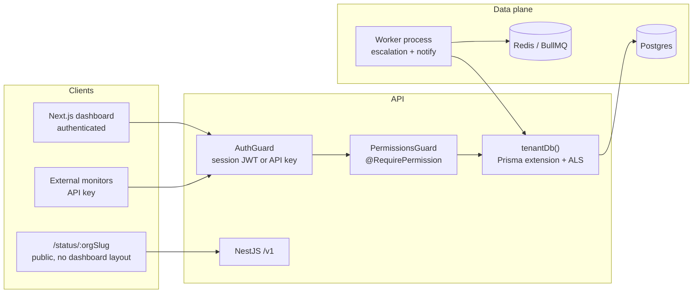

# Waypoint

Multi-tenant incident response and public status pages — a PagerDuty + Statuspage hybrid.

Organizations define services and (in later phases) on-call rotations. When something breaks, an incident is opened, responders act on a real state machine, and an **unauthenticated** status page reflects that org’s current and historical status. Every query is tenant-scoped at the data-access layer. Every mutating endpoint is gated by RBAC on the API, not by frontend route guards.

> Phase 0 (this commit): scaffolding, auth, tenancy, RBAC, services/incidents CRUD, public status page, CI. Escalation timers and realtime push are stubbed, not faked.

## Architecture



| Layer | Choice | Why |
| --- | --- | --- |
| API | NestJS | Guards/decorators map 1:1 onto RBAC; modules match the domain |
| DB | Prisma | Client extension can *force* `orgId` onto every tenant query |
| Auth | Nest JWT cookie + API keys | Auth lives on the API (source of truth for actor/org/scopes). Auth.js would split session auth into Next and leave API keys on Nest |
| Jobs | BullMQ worker | Escalation must survive process restart — never `setTimeout` |
| Frontend | Next.js App Router | Dashboard route group is structurally separate from `/status/[orgSlug]` |
| Monorepo | pnpm workspaces | Solo-dev velocity; Turbo can land later if build graphs hurt |

Tenancy is not an `org_id` filter sprinkled in controllers. `tenantDb()` refuses to run without AsyncLocalStorage context and **overwrites** any caller-supplied `orgId` on create.

## Local setup

Requires Docker, Node 22, and pnpm 9. Postgres is published on **host port 5433** so it does not collide with a local Postgres on 5432 (inside Compose the DB still listens on 5432).

```bash
cp .env.example .env
docker compose up -d postgres redis
pnpm install
pnpm db:migrate:deploy   # after first install, or: pnpm --filter @waypoint/db migrate
pnpm test
pnpm dev                 # api :3001, web :3000, worker
```

Full stack in Docker (API + worker + web + Postgres + Redis):

```bash
docker compose up --build
```

- App: http://localhost:3000
- API health: http://localhost:3001/health
- Register **two** orgs in different browsers (or incognito) to see isolation
- Public status: http://localhost:3000/status/&lt;org-slug&gt;

### Prove the interesting bits

1. Register Acme as Alice (admin). Create a service + incident.
2. Register Globex as Bob. Bob’s incident list is empty; requesting Alice’s incident id returns **404**, not an empty body.
3. In Acme settings, invite a **viewer**. Log in as the viewer: they can read incidents, but Ack/Resolve returns **403**.
4. CI runs the same tests on every PR (`.github/workflows/ci.yml`).

## Demo GIF

_Placeholder — record after Phase 1 (escalation) when the loop is visible: trigger → page → ack in a second window → status page updates._

`docs/demo.gif`

## What I'd change with more time

- Row-level security in Postgres as defense in depth on top of the Prisma extension
- Real invite emails instead of admin-set passwords
- Compiled API (`tsc` → `dist`) instead of `tsx` in production images
- Multi-org users with an org switcher (JWT currently binds one membership)
- Hosted Auth.js/Clerk if we wanted social login without owning password hashing
- Cache-Control + CDN on the public status route (it’s already a separate layout/data path)
- OpenAPI spec generated from the Nest controllers

## Repo map

```
apps/web          Next.js — (dashboard) vs /status/[orgSlug]
apps/api          NestJS — auth, RBAC, tenancy, services, incidents
apps/worker       BullMQ processors (stubs in Phase 0, wired to Redis)
packages/db       Prisma schema + tenantDb()
packages/shared-types   Roles, permissions, incident states (single source of truth)
tests/integration Tenancy isolation + RBAC boundary
```
